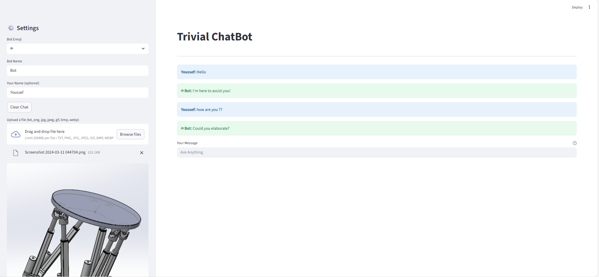
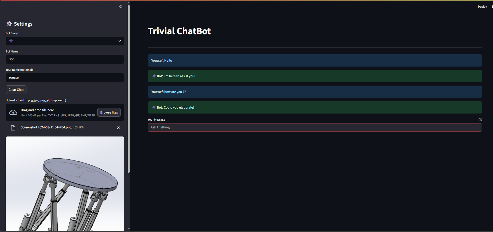

# 🤖 Trivial ChatBot

A minimal, chatbot built with **Python**, **Streamlit**, and  **OOP principles**.  
Designed as a hands-on project to help practice real-world class organization and UI design — while keeping things light-hearted with random responses.

---

## 📸 Screenshots

| Light Mode | Dark Mode |
|------------|-----------|
|  |  |

---

## 🚀 Features

- 🎨 Toggle between Dark and Light themes
- 🧠 Random AI-like responses (for practice)
- 📁 File upload and preview support
- 🤖 Customizable bot name and emoji
- 🔁 Session memory using `st.session_state`

---

